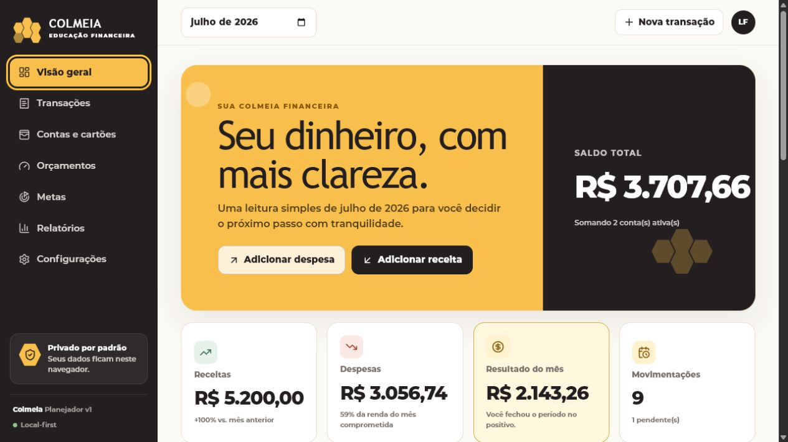

# Colmeia Educação Financeira

Planejador financeiro local-first para organizar contas, cartões, receitas,
despesas, orçamentos e metas com clareza e sem linguagem punitiva.

Versão privada publicada: https://colmeia-planejador-financeiro.lucascampos.chatgpt.site

## Funcionalidades

- Onboarding em quatro etapas e demonstração fictícia opcional.
- Dashboard mensal, saldo, categorias, orçamentos, metas e compromissos.
- Contas, cartões e transações com edição, busca, filtro e confirmação.
- Orçamentos mensais e metas com progresso.
- Relatórios filtráveis e tabelas alternativas acessíveis.
- Backup JSON, CSV e importações com validação e pré-visualização.
- IndexedDB, service worker, PWA e layouts desktop/mobile.

## Stack

React 19, TypeScript estrito, App Router, Vinext/Vite, CSS com tokens, Dexie,
Zod, React Hook Form, Vitest, Testing Library e Playwright.

## Começar

Requer Node 22 e pnpm 11.

1. pnpm install
2. pnpm dev
3. Abra http://localhost:3000

## Qualidade

- pnpm typecheck
- pnpm lint
- pnpm format:check
- pnpm test
- pnpm test:e2e
- pnpm build
- pnpm build:pages

## Armazenamento e backup

Os dados ficam no IndexedDB deste navegador. Limpar dados do navegador pode
apagá-los. Em Configurações, exporte JSON para backup completo ou CSV para
portabilidade de transações. Não existe sincronização automática no MVP.

## Arquitetura e documentação

AGENTS.md é o mapa do harness. Requisitos, decisões, modelo de dados, estratégia
de testes, privacidade e limitações estão em docs/.

## Publicação

O workflow .github/workflows/pages.yml valida o projeto, gera out/ e publica no
GitHub Pages assim que o repositório público for conectado. O build padrão também
produz o pacote compatível com Sites; a versão privada está publicada no link acima.

## Limitações e roadmap

O MVP não possui login, backend, Open Finance, OFX, parcelamento avançado ou
sincronização. O roadmap considera compartilhamento familiar, Supabase,
notificações, planejamento anual, simuladores e assistente educacional.

## Aviso

A Colmeia Educação Financeira oferece ferramentas de organização e educação
financeira. As informações apresentadas não constituem recomendação de
investimento, consultoria financeira, contábil ou jurídica.

## Licença

MIT. Fontes proprietárias do brandbook não estão incluídas.
